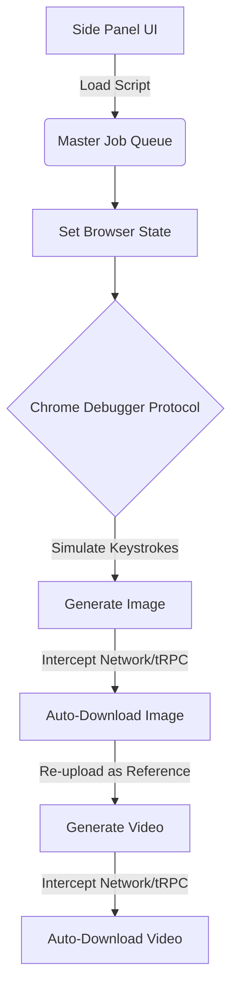

# 🤖 Personal Auto Flow (Browser RPA Orchestrator)

> High-leverage Chrome extension built to automate bulk generative media pipelines and bypass strict anti-bot detection walls via the Chrome Debugger Protocol.

  
  
  

---

## 📋 Table of Contents
- [Overview](#overview)
- [Key Features](#key-features)
- [Architecture](#architecture)
- [Technical Decisions](#technical-decisions)

## 🔍 Overview
**The Problem:** Running bulk media generation on platforms like Google's Flow AI requires constant manual interaction (typing prompts, waiting for generation, clicking download). Standard JavaScript DOM injections fail because modern platforms use aggressive anti-bot scripts that detect automated behavior.

**The Solution:** I engineered a custom Chrome Extension that acts as an autonomous orchestrator. Instead of interacting with the DOM layer, it connects directly to the browser's lower-level **Chrome Debugger Protocol (CDP)** to simulate physical mouse movements and keystrokes.

**My Approach (Vibe Coding):** I built this complex orchestration tool entirely through AI-assisted development (vibe coding), architecting the logic and generating the code through precise natural language prompting.

## ✨ Key Features
- **Low-Level Execution:** Utilizes CDP (`Input.dispatchMouseEvent` and `Input.dispatchKeyEvent`) to physically click and type out prompts character-by-character with randomized, human-like typing delays to bypass security scripts.
- **Network & File Interception:** The background scripts intercept internal tRPC streaming endpoints to catch `.mp4` and `.png` download links the exact moment the backend finishes rendering. 
- **Auto-Naming Logic:** Completely overrides Chrome's native download path to silently capture files and rename them sequentially based on an imported scene queue (e.g., `V1-S1.mp4`).
- **Multi-Stage Queue Engine:** Driven by a custom Side Panel, it parses a plain-text script, switches the browser state between Text-to-Image and Image-to-Video modes, and manages the entire pipeline completely untouched by human hands.

## 🏗️ Architecture / Workflow

## 🧠 Technical Decisions & Challenges
*   **Bypassing Bot Detection:** Early iterations using standard `document.querySelector().click()` were immediately flagged. The architectural pivot to use the `chrome.debugger` API was necessary to interact at the OS-event level, successfully tricking the anti-bot walls into seeing human interactions.
*   **Handling Asynchronous Rendering:** Because generation times vary wildly, relying on static `setTimeout` functions caused failures. I implemented network request interception to "listen" for the exact moment the server responded with a media URL, making the tool 100% reliable regardless of generation wait times.

---

> ⚠️ **Note:** This repository is a Project Showcase. As this involves proprietary RPA systems and interacts with live third-party platforms, the source code is kept private. This README serves as a technical case study of the architecture and implementation.
